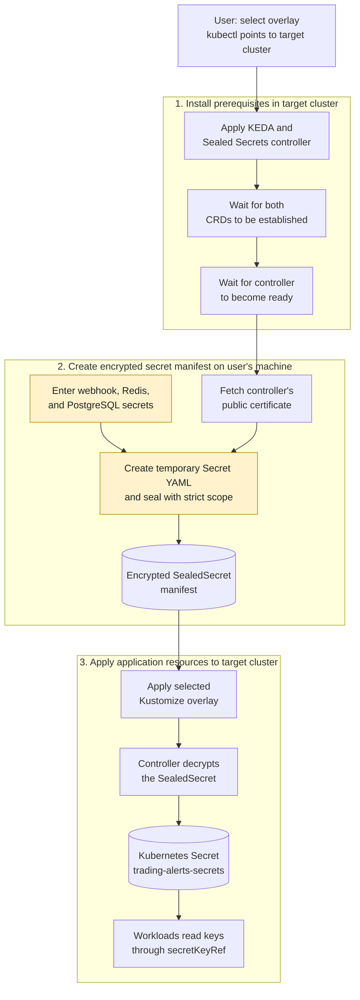

# Kubernetes secret bootstrap and deployment

The bootstrap script installs the supporting infrastructure first, then creates the encrypted secret manifest and applies the selected application overlay. The diagram shows where secret values are handled and how workloads receive the resulting Kubernetes Secret.

Only the encrypted `SealedSecret` manifest is suitable for storing in Git; do not commit plaintext values or the temporary Secret YAML. The Sealed Secrets public certificate is used to encrypt values and is not sufficient to decrypt them. Decryption uses the controller's private key in the target cluster.

The bootstrap script selects the overlay before installing infrastructure, waits for both CRDs and for the controller deployment to become ready, generates the manifest, then applies the overlay. The default interactive mode prompts for values without echoing them. Non-interactive use requires all three values; avoid passing real credentials as command-line arguments because they may be exposed in shell history or process listings.
