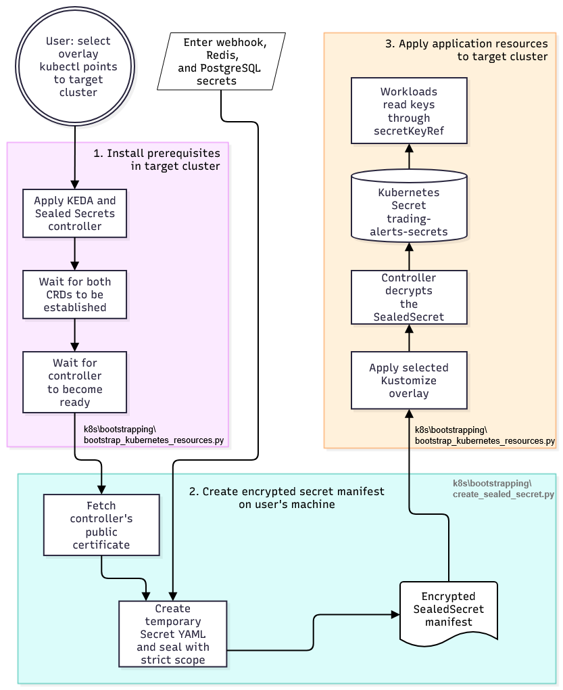

# Kubernetes secret bootstrap and deployment

The bootstrap script installs the supporting infrastructure first, then creates the encrypted secret manifest and applies the selected application overlay. The diagram shows where secret values are handled and how workloads receive the resulting Kubernetes Secret.

Only the encrypted `SealedSecret` manifest is suitable for storing in Git; do not commit plaintext values or the temporary Secret YAML. The Sealed Secrets public certificate is used to encrypt values and is not sufficient to decrypt them. Decryption uses the controller's private key in the target cluster.

> [!NOTE]
> - The tools `kubectl` and `kubeseal` have to be installed and be available on your system's `PATH`.
> - The script requires `kubectl` connected to the target cluster.  

The `k8s/bootstrapping/bootstrap_kubernetes_resources.py` bootstrap script selects the overlay before installing infrastructure, and waits for both CRDs and for the controller deployment to become ready. It then runs `k8s/bootstrapping/create_sealed_secret.py` to prompt for secret values and write the encrypted manifest at `k8s/manifests/base/apps/trading-alerts-sealedsecret.yaml`. Secret values can also be supplied using `--webhook-secret`, `--redis-password`, and `--postgres-password` when calling either script. If only a subset of all secrets is passed the script will still prompt for the missing values. However `--non-interactive` disables prompts and requires all three values. 
> [!IMPORTANT]
>  - The `--non-interactive` mechanism is meant for CI usage and will ensure the script failing if not all necessary values are provided.
> - `--non-interactive` will rename any preexisting sealed secret file with a UTC timestamp in its name before the new manifest is written.
> - The bootstrap script accepts the same commandline options which are then passed passes on to the secret creation script.

> [!WARNING]
> Since command-line arguments may be visible in process listings and shell history, only use this mechanism for temporary dummy values or in non sensitive environments. 

The bootstrap script also accepts `--overlay` to select an overlay without prompting. In non-interactive mode, it selects the only available overlay automatically or requires `--overlay` if there is more than one.

