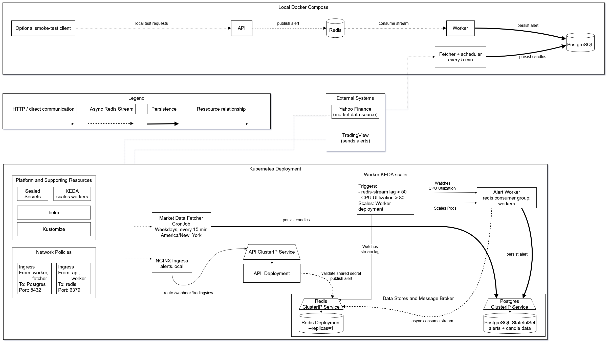

# Trading Alerts

This project is a small, containerized backend for collecting and processing trading alerts and market data. A webhook API accepts TradingView alerts, validates a shared secret, and places valid alerts on a Redis stream. A worker consumes the stream and stores alerts in PostgreSQL. A separate fetcher retrieves market candle data and stores it in the same database.

## General architecture

TradingView sends alerts to the API, which validates each alert's shared secret and publishes valid alerts to a Redis stream. The worker consumes that stream and persists alerts to PostgreSQL. Independently, the market-data fetcher periodically retrieves candle data from Yahoo Finance and stores it in PostgreSQL.

The same services can run locally with Docker Compose or be deployed to Kubernetes. In Kubernetes, ingress routes webhook requests to the API, network policies constrain service access to Redis and PostgreSQL, and KEDA scales the worker based on Redis stream lag and CPU utilization.



You can [open the architecture image](docs/architecture_overview.png) to view it larger.

## Project structure

- `services` — application code, Dockerfiles, and tests for each service.
    - `services/api/` — webhook API that validates and queues alerts.
    - `services/worker/` — consumes queued alerts and stores them in PostgreSQL.
    - `services/fetcher/` — retrieves market candle data and stores it in PostgreSQL.
    - `services/db/` — database initialization scripts.
- `k8s/` — everything needed to deploy and test the application on Kubernetes
    - `k8s/manifests/` — Kustomize resources for Kubernetes applications, environment overlays, and supporting infrastructure.
    - `k8s/bootstrapping/` — scripts to bootstrap a Kubernetes cluster with Sealed Secrets and create the encrypted manifest, plus a helper for Minikube.
    - `k8s/tests/` — tests to exercise the application in a deployed Kubernetes cluster.
- `docs/` — project notes and architecture decision records.
    - See [`docs/architecture_decision_records/`](docs/architecture_decision_records/) for decisions about Redis, PostgreSQL, secrets, Kustomize, and staged deployment
    - See [`docs/debugging_note.md`](docs/debugging_note.md) for an overview of how errors encountered during development were investigated and addressed.

## Running locally

Docker Compose starts the API, worker, fetcher, Redis, and PostgreSQL:

```bash
docker compose -f Dockercompose.yaml up --build
```

The API is available at `http://localhost:8000`. Local Compose credentials are for development only; do not use them in shared or production environments.

## Sending TradingView webhook alerts

Send an HTTP `POST` request to `/webhook/tradingview` with a JSON body. The `secret`, `symbol`, and `action` fields are required; `price` and `timeframe` are optional.

```json
{
  "secret": "YOUR_WEBHOOK_SECRET",
  "symbol": "AAPL",
  "action": "long",
  "price": 210.5,
  "timeframe": "5m"
}
```

Set the `secret` to the same value as the API's `WEBHOOK_SECRET`. In TradingView, configure the alert message as this JSON and use the webhook URL for the running API. Supported action examples include `long`, `short`, and `close`.

## Kubernetes

The application is containerized and can also be deployed to a Kubernetes cluster. Kubernetes manifests are organized with Kustomize under `k8s/manifests/`, allowing shared configuration to be separated from environment-specific settings. A local cluster such as kind or Minikube can be used for testing, with cloud-specific configuration added when deploying to a platform such as Amazon EKS.

For Minikube, make sure the cluster has already been started and, when required by your Minikube driver, that the Docker daemon is running. Check the cluster with `minikube status` or review the output of the image build-and-load script below. Before applying the Kubernetes manifests, use Docker Compose to build the application images; the Compose configuration tags them with the names expected by the Kubernetes deployments:

```bash
python k8s/bootstrapping/minikube/build_and_load_images.py
```

To bootstrap a cluster, make sure `kubectl` points at the target cluster and both `kubectl` and `kubeseal` are available. On Windows they both should be on `PATH`.
Then run:

```bash
python k8s/bootstrapping/bootstrap_kubernetes_resources.py
```

The bootstrap script installs the Sealed Secrets controller, prompts for the application secret values, writes the encrypted SealedSecret manifest, and applies the selected overlay.

## CI/CD and platform infrastructure

The `application-ci.yml` workflow runs on pushes that change files under `services/`, `Dockercompose.yaml`, or the workflow itself. It runs Ruff over the Python services, audits each service's Python dependencies, builds and scans the API, worker, and fetcher images for HIGH and CRITICAL vulnerabilities, and runs the API unit tests plus the Docker-based worker smoke and API-to-worker integration tests.

The Docker-based test scripts honor `COMPOSE_NO_REBUILD_IN_TESTS=1`; CI sets it so the tests reuse the service images built earlier in the test job. When run locally without that variable, the scripts build images as needed. The workflow does not run on pull requests, publish images, or deploy to Kubernetes.

For instructions covering local application unit tests, Docker smoke and integration tests, and Kubernetes manifest and cluster tests, see the [local testing guide](docs/local-testing.md).

Platform infrastructure is managed separately in the `market-alerts-platform` repository.
